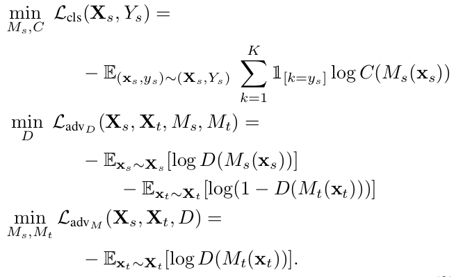

# Adversarial Discriminative Domain Adaptation [[Paper]](https://arxiv.org/abs/1702.05464)

Eric Tzeng, Judy Hoffman, Kate Saenko, Trevor Darrell

## Summary

- Proposes a novel unified framework for adversarial domain adaptation, allowing us to effectively examine the different factors of variation between the existing approaches and clearly view the similarities they each share.

- Also proposes a new method called Adversarial discriminative domain adaptation based on this general framework which outperforms previous SOTA on standard cross-domain digit classification tasks.

## Generalized adverserial adaptation

- In unsupervised adaptation we have access to source images and labels, and target images, but dont have access to target labels.

- In adverserial adaptive methods, we usually train a source encoder and classifier, cause that is supervised. And then try to somehow encode the target encodings in a way close to the source encodings so that we can use the source classifier for the target encodings also.

- All approaches minimize distance b/w source and target encodings by alternating b/w two minimizations.

- First a domain discriminator which classifies whether the embedding is from the source or target distribution.

- Second the source and encoder are trained in a way to fool the discriminiator.

- There are two broad choices for the base models - 1.) Discriminative - Input images are mapped in a space good for discriminative tasks such as image classification. 2.) Generative - We train to learn embeddings that can help generate new images similar to the input, some intermediate feature of the discriminator is used for training a task specefic classifier afterwards.

- There are two approaches for weight sharing in the encoder. 1.) Shared - The source and target have the same encoder weights - Less number of parameters, but poor performance since same weights are used for two different domains. 2.) Unshared - Initializing the target encoder with the source encoder and only constraining some or none of the layers to be similar to that of the source.

- All approaches train the discriminator with the standard discriminator loss, but vary in the loss for training the target encoder. 1.)Minmax loss - The encoder simply tries to maximize the standard discriminator loss 2.)GAN loss - Instead of maximizing he discriminator loss, we still minimize it, but now we use inverted labels. (same thing, but with better convergence) 3.) Confusion loss - the mapping is trained using a cross-entropy loss function against a uniform distribution to ensure that the discriminator views the two domains identically.

## Adversarial discriminative domain adaptation

- Discriminative Base model, unshared weights and GAN loss.

- The model has 4 components, a source encoder, a target encoder , a classifier and a discriminator.
- First we train the source encoder and classifier for the task of image classification in the source domain in a supervised fashion.
- Now we fix the source encoder and the classifier and also initialize the target classifier with the source encoder parameters.
- Then we iterate b/w two optimizations. One - we only train the discriminator, in discriminating b/w the source and the target encodings. Second - We train only the target encoder, into generating such target encodings that the discriminator classifies them as source encodings (Discriminator loss with inverted labels).
- During testing in the target domain we use the target encoder and the orignal classifier to make the predictions.

## Implementation Details

- Tested on different combinations of MNIST,USPS,SVHN datasets as the source and target domain.

- Using LeNet based encoder and classifier

- For discriminator - 3 layered FCN, two layers of dimension 500 followed by a single dimensional discriminator output. ReLU activation for the 500 dimensional layers.

